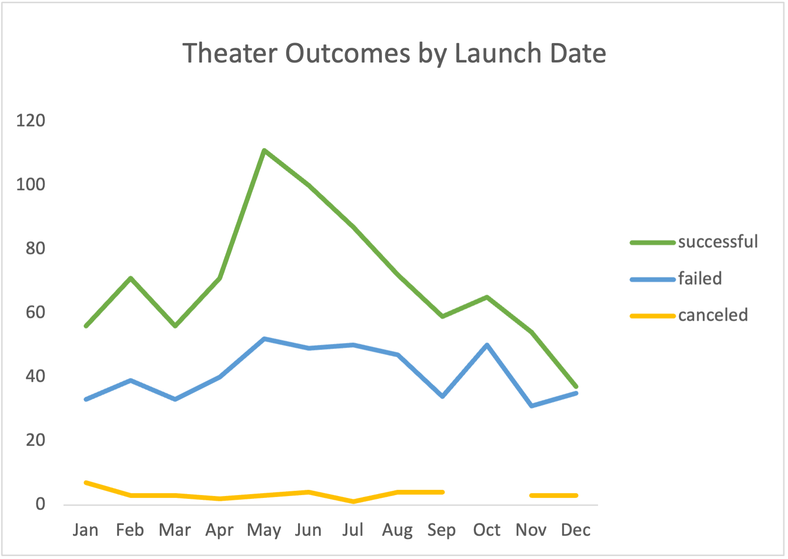
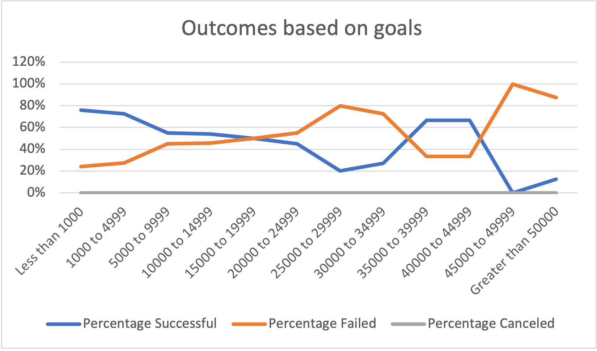

# Kickstarting with Excel

## Overview of Project

### An analysis of Kickstarter theater funding campaign outcomes to identify trends that will help a client create a successful new theater campaign.

## Analysis and Challenges
Analysis performed on historical Kickstarter data using Excel.

### Analysis of Outcomes Based on Launch Date
Campaigns launched between May and June are historically the most successful with a 65-67% success rate, while December is the month with the lowest percentage of success for campaign launches, at 49%. 

### Analysis of Outcomes Based on Goals
There is a clear trend of success for campaigns with goals under $15,000 and a break-even 50/50 result for campaigns with goals between $15,000 and $19,999. As the chart shows, when campaign goals go above $20,000 they are more likely to fail. However, this trend reverses briefly for campaigns with goals from $35,000 to $44,999, which have a winning trend, until $45,000 when campaigns trend heavily again towards failure.

## Results
The trends indicate that the best time for the client to launch her campaign would be in May or June. If possible, the client should also avoid launching in the winter months as December and January campaigns show the lowest success rate.

My recommendation would be to launch with a goal under $15,000 because there is a clear pattern of success for campaigns with goals under this goal amount. However, if the client needs to raise a larger amount, the data also supports a goal in the $35,000-45,000 range, which showed a 67% success rate. 
 
### Challenges and Difficulties Encountered

The current dataset does not reveal how many pledges were made at different price levels and what types of incentives were offered for pledges. Having this additional data could help reveal which types of incentives were most successful in pushing donations up to higher pledge points.

It might be helpful to create an additional graph that shows how many backers were needed to push successful theater projects over the top to get a picture of whether the needle was moved more often by small donations vs large ones. 